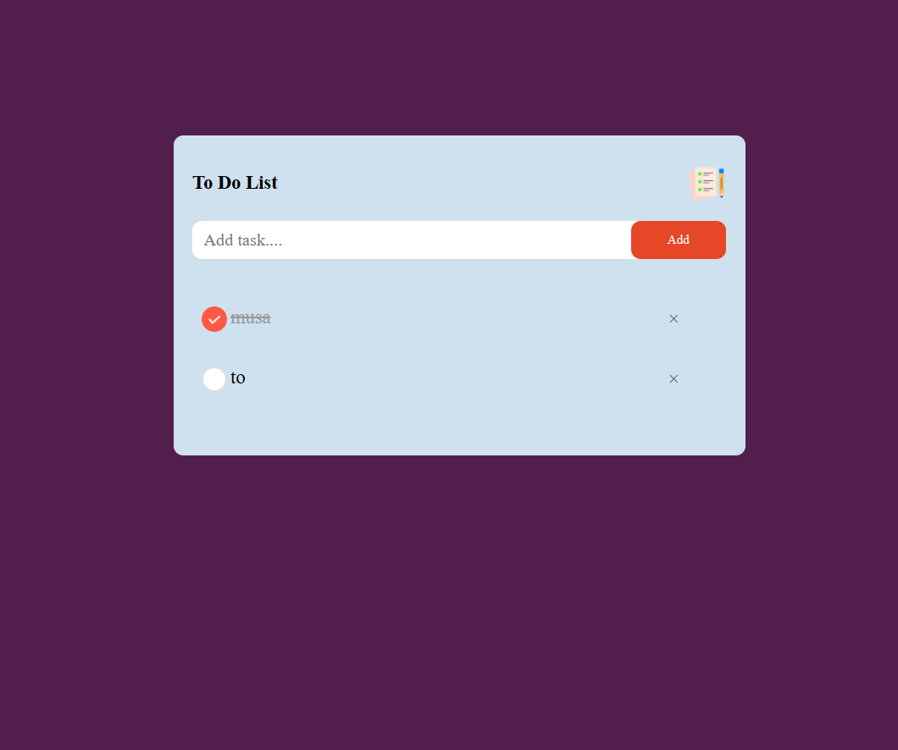

# A to do list App

Like every day today. most people use todolist apps to schedule their programs and other day to do activities approprately.

#### Description

This project focusses on the use of javascript functions like how to save data, update data on local storage which is one of most important activities of this kind of apps

##### Getting started

###### Prerequisites

There are no special requirements for this project

###### Intsallation

1. Clone on this repository

```
git clone git@github.com:Hashmozy/to-do-list.git
```

2. Navigate the project

```
cd to-do-list
```

3. > Run the project

   ```
   node app.js / use the live server extension in your vs code

   ```

   #### Usage

   U can use this project for your learning purposes

   
